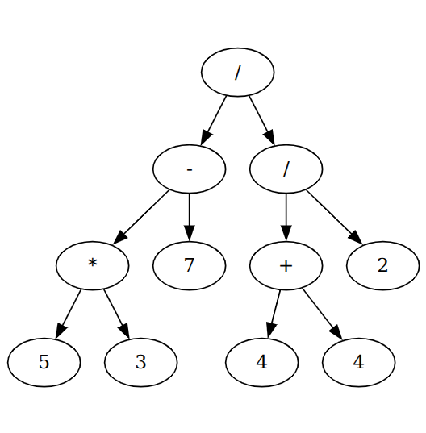

# Math Operation Tree Parsing Visualizer
a simple python app that tokenizez,parses complex user input to get the final result value, then visualizes the parsing tree using graphviz

## Requirements
1. python3
2. graphviz library

## Installation

1. make sure graphviz is installed:
```console
pip install graphviz
```
2. run the app with any args of your liking:
```console
python main.py -v -o ~/Desktop/graphviz
```

## Usage

the app can be ran with the flags -v for verbose tokenizer output and -o for specifying output folder, after running the app you can give it input to calculate, make sure numbers are only one digit long and and the only symbols that are used are : */()+-

- example:
```console
python main.py -v -o ~/Desktop/outputviz
((5*3)-7)/((4+4)/2)
```
- output :    

